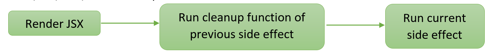

# useEffect()

Trước khi vào khái niệm **Effects** , ta cần phân biệt trước hai loại logic ở bên trong một component:

- **Rendering code** (thường được gọi là phần giao diện): nằm ở cấp cao nhất của component. Đây là nơi bạn lấy các `props`, `state` và biến đổi chúng, trả về **JSX** mà bạn muốn hiển thị lên trên màn hình trình duyệt.
- **Event handlers** (trình xử lý sự kiện): là các hàm lồng nhau bên trong component để xử lý tương tác của người dùng. Ví dụ như sự kiện nhập vào ô input, click vào button,…

:::note

❗️Đôi khi hai loại trên là chưa đủ. Ví dụ như một ChatRoom (phòng chat) phải kết nối với máy chủ trò chuyện bất cứ khi nào nó hiển thị trên màn hình. Việc kết nối máy chủ này không thể xảy ra trong quá trình hiển thị, và không có sự kiện cụ thể nào giống như một cú nhấp chuột khiến ChatRoom được hiển thị

:::

🔑 **Effects** cho phép bạn chỉ định các **side effects** do chính nó gây ra, chứ không phải do một sự kiện cụ thể. Gửi tin nhắn trong cuộc trò chuyện là một sự kiện vì nó trực tiếp do người dùng nhấp vào một nút cụ thể gây ra. Tuy nhiên, thiết lập kết nối máy chủ là một **Effects** vì nó cần phải xảy ra bất kể tương tác nào khiến component xuất hiện. **Effects** chạy ở cuối quá trình render sau khi màn hình cập nhật. Đây là thời điểm tốt để đồng bộ hóa các thành phần React với một số hệ thống bên ngoài (như mạng hoặc thư viện của bên thứ ba)

⚠ Lưu ý rằng **Effects** thường được sử dụng để “tách” khỏi đoạn mã React và đồng bộ hóa với một số hệ thống bên ngoài. Điều này bao gồm các API của trình duyệt, tiện ích con của bên thứ ba, mạng...

- Để sử dụng **Effects** , ta cần làm theo 3 bước:
  - **Khai báo một Effect** : theo mặc định, **Effect** sẽ chạy sau mỗi lần render.
  - **Chỉ định Effect dependencies** : hầu hết các **Effect** sẽ chạy lại khi cần thiết thay vì chạy lại sau mỗi lần component re-render. Ví dụ chỉ gọi lại API sau mỗi lần pages trong đường dẫn thay đổi
  - **Thêm hàm cleanup (nếu cần)** : một số **Effect** cần chỉ định việc dừng/hoàn tác thực hiện. Ví dụ: “connet”cần “disconnet”,…

## Khai báo

```tsx
import { useEffect } from "react";
function MyComponent() {
  useEffect(() => {
    // Code here will run after *every* render
  });
  return <div />;
}
```

- Mỗi khi component được render, React sẽ cập nhật hiển thị trên màn hình **TRƯỚC** , và chạy đoạn mã trong useEffect **SAU** . Nói cách khác, `useEffect` “trì hoãn” một đoạn mã chạy cho đến khi render đó được hiển thị trên màn hình

## Chỉ định Effect dependencies

- Theo mặc định, **Effect** chạy sau mỗi lần render. Thông thường, đây không phải là điều ta muốn, đôi khi ta muốn **Effect** chạy lại dựa trên các yếu tố thay đổi khác. Ví dụ **Effect** chỉ chạy khi biến “a” thay đổi so với lần trước đó,… Vì vậy, **Effect** cho phép ta truyền vào `useEffect` tham số thứ 2

```tsx
useEffect(() => {
  /* This code runs every render */
})

useEffect(() => {
  /* This code runs only on mounted (when the component appears) */
}, [])

useEffect(() => {
  /* This code run on mounted and if "a" or "b" has changed since the last render */
}, [a, b,...])
```

⚠ Lưu ý rằng đôi khi chúng ta không thể tùy ý chọn `dependencies`. Nó còn phụ thuộc vào biến được sử dụng trong hàm `useEffect` . Ví dụ:

```tsx
useEffect(() => {
  if (shouldFocus) {
    ref.current.focus();
  }
}, []);
```

:::note

Đoạn code trên sẽ báo lỗi do ta đang sử dụng `shouldFocus` bên trong `useEffect`, để khắc phục, ta phải thêm `shouldFocus` làm `dependencies`

:::

```tsx
useEffect(() => {
  if (shouldFocus) {
    ref.current.focus();
  }
}, [shouldFocus]);
```

## Cleanup function

- Xem xét một ví dụ sau đây:

```tsx
export default function ChatRoom() {
  useEffect(() => {
    const connection = createConnection();
    connection.connect();
  }, []);
  return <h1>Welcome to the chat!</h1>;
}
```

:::caution

Ta có một component “ChatRoom”. Khi component này “mounted”, nó sẽ gọi `connection.connect()` (1). Sau đó giả sử người dùng đi đến trang “Setting”, component “ChatRoom” sẽ “unmounted”. Cuối cùng, người dùng quay trở lại “ChatRoom” và component này lại một lần nữa “mounted” và `connection.connect()` (2) sẽ được gọi lại, điều này sẽ thiết lập kết nối thứ hai – nhưng kết nối đầu tiên sẽ không bao giờ bị phá hủy. Do đó, khi người dùng điều hướng nhiều lần, các kết nối sẽ liên tục được thiết lập lại, dẫn đến rò rỉ bộ nhớ. Do đó ta phải sử dụng **cleanup function**

:::

- **Cleanup function** giúp ta “dọn dẹp” các logic **side effects** từ lần render trước trước khi thực hiện **side effects** ở lần render kế tiếp hoặc khi component unmounted.
- Chú ý rằng **cleanup function LUÔN** được thực hiện trước khi component re-render/unmounted, bất kể đoạn **side effect** có đoạn code bất đồng bộ



- Cách viết:

```tsx
useEffect(() => {
  /* Code for side effects */
  return () => {
    /* Code for cleanup function */
  };
}, []);
```

- Ví dụ về **cleanup function** :

```tsx
useEffect(() => {
  function handleScroll(e) {
    console.log(e.clientX, e.clientY);
  }
  window.addEventListener("scroll", handleScroll);
  return () => window.removeEventListener("scroll", handleScroll);
}, []);
```
